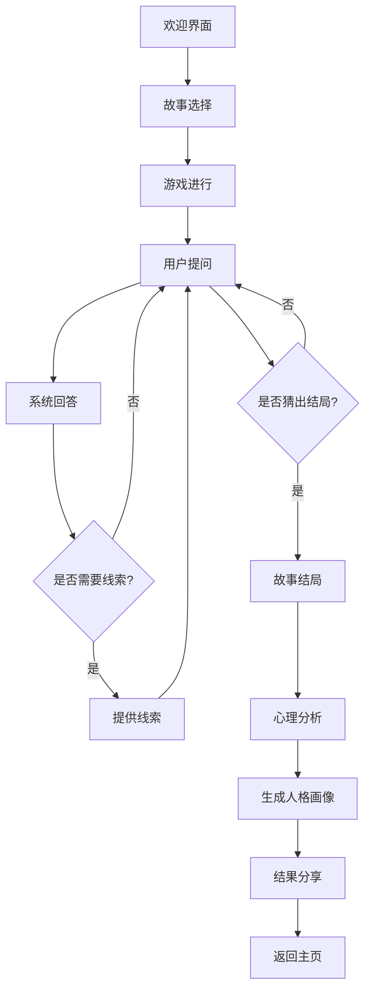

# 海龟汤形式心理测试游戏产品需求文档

## 1. 产品概述

### 1.1 产品背景
随着心理健康意识的提升，人们对自我认知和心理状态评估的需求日益增长。传统的心理测试往往形式单一、趣味性不足，难以吸引用户持续参与。海龟汤游戏作为一种情境猜谜游戏，具有高度的互动性和趣味性，适合作为心理测试的载体。

### 1.2 产品目标
开发一款基于海龟汤游戏形式的心理测试应用，通过互动式的故事解谜过程，实现对用户心理状态的初步筛查，并生成个性化的人格画像。

### 1.3 目标用户
- **年龄段**：18-35岁
- **兴趣**：心理测试、解谜游戏、自我探索
- **需求**：压力释放、自我认知、社交分享

### 1.4 产品价值
- 提供有趣味性的心理测试体验
- 帮助用户了解自己的人格特征和优势
- 促进心理健康意识的提升，培养积极心态
- 为用户提供个性化的自我提升建议，基于积极心理学原理
- 增强用户的心理韧性和幸福感

## 2. 核心功能

### 2.1 功能模块

| 模块名称 | 功能描述 |
|---------|--------|
| 故事管理系统 | 故事库管理、故事难度分级、故事内容动态加载 |
| 互动系统 | 自然语言处理、智能问答匹配、线索提示机制 |
| 心理分析系统 | 行为数据分析、心理特征提取、结果报告生成、人格画像生成 |
| 用户管理系统 | 匿名用户支持、历史记录追踪、结果存储与对比 |

### 2.2 核心功能详情

#### 2.2.1 故事管理系统
- **故事库管理**：至少包含5个核心故事，覆盖不同心理维度
- **故事难度分级**：根据推理复杂度和心理测试深度进行分级
- **故事内容动态加载**：根据用户进度和人格特征推荐合适的故事

#### 2.2.2 互动系统
- **自然语言处理**：理解用户的自然语言提问
- **智能问答匹配**：根据故事内容和用户提问提供准确的回答
- **线索提示机制**：根据用户进展提供适当的线索

#### 2.2.3 心理分析系统
- **行为数据分析**：分析用户的提问类型、推理路径、反应时间等
- **心理特征提取**：基于大五人格模型提取用户的人格特征
- **结果报告生成**：生成详细的心理分析报告
- **人格画像生成**：
  - 数据采集：收集用户游戏过程中的所有交互数据
  - 特征提取：从行为数据中提取人格相关特征
  - 模型构建：基于大五人格模型构建分析框架，利用通义千问API进行自然语言分析
  - 卡通图片生成：利用AI图像生成技术根据人格特征生成个性化卡通形象
  - 综合画像生成：结合卡通形象和雷达图/热力图等多维度可视化人格画像
  - 结果解读：采用有趣幽默的语言风格，类似于MBTI测试的解读方式

#### 2.2.4 用户管理系统
- **匿名用户支持**：允许用户匿名参与游戏
- **历史记录追踪**：记录用户的游戏历史和测试结果
- **结果存储与对比**：存储用户的测试结果，支持不同时间点的结果对比

## 3. 核心流程

### 3.1 用户游戏流程

1. **欢迎界面**：介绍游戏规则和隐私说明
2. **故事选择**：随机分配或用户选择故事
3. **游戏进行**：
   - 展示故事背景
   - 用户提问（文本输入）
   - 系统回答（是/否/无关）
   - 提供线索（基于用户进展）
4. **故事结局**：揭示完整故事
5. **心理分析**：生成个性化分析报告和人格画像
6. **结果分享**：可选的社交分享功能

### 3.2 系统流程图

## 4. 界面设计

### 4.1 设计风格
- **主色调**：深蓝色和紫色为主，营造神秘、探索的氛围
- **辅助色**：暖色调点缀，增强用户体验
- **字体**：无衬线字体，清晰易读
- **图标**：简约风格，符合现代设计趋势
- **视觉元素**：海龟、汤碗、谜题等元素，强化品牌识别

### 4.2 页面设计

#### 4.2.1 欢迎页面
- **布局**：居中布局，包含游戏标题、简介和开始按钮
- **视觉元素**：海龟汤主题插画，动态效果
- **交互**：开始游戏按钮，规则说明链接

#### 4.2.2 故事选择页面
- **布局**：卡片式布局，展示不同故事的封面和简介
- **视觉元素**：每个故事有独特的视觉风格
- **交互**：点击卡片选择故事，难度标识

#### 4.2.3 游戏进行页面
- **布局**：上方故事背景，中间提问输入框，下方对话历史
- **视觉元素**：故事场景插画，对话气泡
- **交互**：文本输入，发送按钮，线索请求按钮

#### 4.2.4 结果页面
- **布局**：上方卡通人格画像，下方分析报告
- **视觉元素**：个性化卡通形象，雷达图/热力图
- **交互**：分享按钮，查看详细报告按钮

### 4.3 响应式设计
- **桌面端**：完整功能，多列布局
- **平板端**：适配屏幕尺寸，调整布局
- **移动端**：简化布局，优化触摸交互

## 5. 技术实现

### 5.1 技术栈

#### 5.1.1 前端
- **框架**：React.js 或 Vue.js
- **UI库**：Tailwind CSS 或 Ant Design
- **动画**：CSS3 动画 + Framer Motion
- **图像处理**：支持卡通图片展示和交互的组件库

#### 5.1.2 后端
- **服务器**：Node.js + Express
- **数据库**：MongoDB
- **AI集成**：阿里通义千问免费模型（生成故事、分析用户回答和生成卡通形象）

### 5.2 核心技术点

#### 5.2.1 自然语言处理
- 利用通义千问API处理用户提问
- 建立关键词匹配系统，提高问答准确性

#### 5.2.2 人格画像生成
- 基于大五人格模型构建分析框架
- 利用AI图像生成技术创建个性化卡通形象
- 设计人格特征到视觉元素的映射规则

#### 5.2.3 数据安全
- 用户数据加密存储
- 匿名用户数据处理
- 符合隐私保护法规

## 6. 测试计划

### 6.1 功能测试
- 测试所有核心功能的正常运行
- 测试边缘情况和异常处理

### 6.2 性能测试
- 页面加载时间测试
- 响应时间测试
- 系统稳定性测试

### 6.3 用户体验测试
- 用户满意度调查
- 用户行为分析
- A/B测试不同设计方案

### 6.4 心理测试有效性验证
- 与专业心理测试结果对比
- 心理学专家评估
- 测试结果的信度和效度分析

## 7. 上线计划

### 7.1 开发阶段
1. **基础架构搭建**：2周
2. **核心功能开发**：4周
3. **内容开发**：3周
4. **测试与优化**：2周
5. **部署与上线**：1周

### 7.2 上线策略
- **内测**：邀请内部人员和少量用户测试
- **公测**：开放给更多用户，收集反馈
- **正式上线**：全量发布，开始运营

### 7.3 运营计划
- **内容更新**：定期更新故事内容
- **用户反馈**：建立反馈机制，持续优化产品
- **社区建设**：建立用户社区，增强用户粘性

## 8. 风险评估

### 8.1 技术风险
- **NLP准确性**：可能影响用户体验
- **AI图像生成质量**：可能影响人格画像的吸引力
- **数据安全**：用户心理数据的保护

### 8.2 内容风险
- **敏感性**：避免触发用户负面情绪
- **伦理问题**：心理测试结果的解读与使用

### 8.3 市场风险
- **用户接受度**：游戏形式的心理测试的接受程度
- **变现模式**：如何实现商业价值

### 8.4 风险应对策略
- 与心理学专家合作，确保测试的专业性和适当性
- 建立严格的用户数据保护机制
- 进行充分的市场测试，验证用户需求
- 设计多元化的变现模式

## 10. 结论

本产品通过将海龟汤游戏与心理测试相结合，并融入积极心理学原理，创造了一种新颖、有趣且具有积极导向的自我认知工具。通过AI技术的应用，实现了个性化的人格画像生成，突出用户的优势和潜力，增强了用户体验和产品价值。

产品具有明确的市场需求和技术可行性，通过合理的开发计划和风险控制，可以打造一款既有趣味性又有专业性的心理测试游戏。通过积极心理学元素的整合，产品不仅能够帮助用户了解自己的人格特征，还能促进心理健康意识的提升，培养积极心态，增强心理韧性和幸福感。

这款产品有望成为心理健康领域的创新工具，为用户提供有价值的自我认知体验，同时为心理健康行业的发展做出贡献。