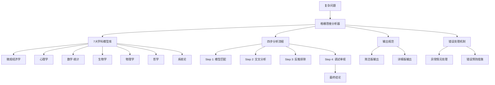
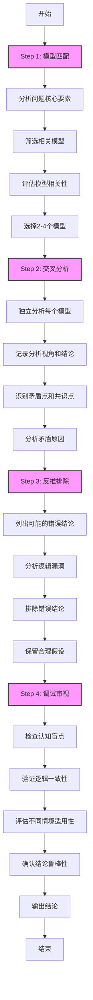
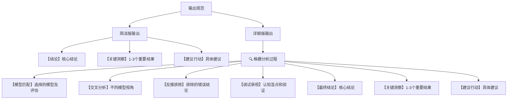
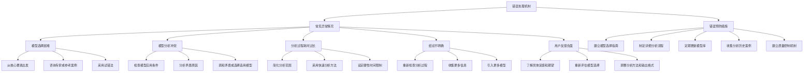

# 格栅思维图形化表示

## 1. 格栅思维整体架构图

```mermaid
graph TD
    A[复杂问题] --> B[格栅思维分析器]
    B --> C[7大学科模型库]
    B --> D[四步分析流程]
    B --> E[输出规范]
    B --> F[错误处理机制]
    
    C --> C1[微观经济学]
    C --> C2[心理学]
    C --> C3[数学·统计]
    C --> C4[生物学]
    C --> C5[物理学]
    C --> C6[哲学]
    C --> C7[系统论]
    
    D --> D1[Step 1: 模型匹配]
    D --> D2[Step 2: 交叉分析]
    D --> D3[Step 3: 反推排除]
    D --> D4[Step 4: 调试审视]
    
    E --> E1[简洁版输出]
    E --> E2[详细版输出]
    
    F --> F1[异常情况处理]
    F --> F2[错误预防措施]
    
    D4 --> G[最终结论]
```

## 2. 四步分析流程图

```mermaid
graph TD
    A[开始] --> B[Step 1: 模型匹配]
    B --> C[分析问题核心要素]
    C --> D[筛选相关模型]
    D --> E[评估模型相关性]
    E --> F[选择2-4个模型]
    F --> G[Step 2: 交叉分析]
    G --> H[独立分析每个模型]
    H --> I[记录分析视角和结论]
    I --> J[识别矛盾点和共识点]
    J --> K[分析矛盾原因]
    K --> L[Step 3: 反推排除]
    L --> M[列出可能的错误结论]
    M --> N[分析逻辑漏洞]
    N --> O[排除错误结论]
    O --> P[保留合理假设]
    P --> Q[Step 4: 调试审视]
    Q --> R[检查认知盲点]
    R --> S[验证逻辑一致性]
    S --> T[评估不同情境适用性]
    T --> U[确认结论鲁棒性]
    U --> V[输出结论]
    V --> W[结束]
    
    style B fill:#f9f,stroke:#333,stroke-width:2px
    style G fill:#f9f,stroke:#333,stroke-width:2px
    style L fill:#f9f,stroke:#333,stroke-width:2px
    style Q fill:#f9f,stroke:#333,stroke-width:2px
```

## 3. 模型库结构图

```mermaid
graph TB
    A[7大学科模型库] --> B[微观经济学]
    A --> C[心理学]
    A --> D[数学·统计]
    A --> E[生物学]
    A --> F[物理学]
    A --> G[哲学]
    A --> H[系统论]
    
    B --> B1[激励机制]
    B --> B2[供需]
    B --> B3[机会成本]
    B --> B4[边际效应]
    B --> B5[比较优势]
    
    C --> C1[损失厌恶]
    C --> C2[从众]
    C --> C3[确认偏误]
    C --> C4[锚定效应]
    C --> C5[达克效应]
    C --> C6[认知失调]
    
    D --> D1[复利]
    D --> D2[概率贝叶斯]
    D --> D3[正态分布]
    D --> D4[回归均值]
    D --> D5[决策树]
    
    E --> E1[演化论]
    E --> E2[适应性景观]
    E --> E3[红皇后效应]
    E --> E4[生态位]
    E --> E5[共生关系]
    
    F --> F1[熵增]
    F --> F2[临界质量]
    F --> F3[惯性]
    F --> F4[杠杆]
    F --> F5[能量守恒]
    
    G --> G1[奥卡姆剃刀]
    G --> G2[第一性原理]
    G --> G3[逻辑谬误]
    G --> G4[认识论边界]
    G --> G5[契约论]
    
    H --> H1[反馈回路]
    H --> H2[涌现]
    H --> H3[瓶颈约束]
    H --> H4[二阶效应]
    H --> H5[系统动力学]
```

## 4. 输出规范图

```mermaid
graph TD
    A[输出规范] --> B[简洁版输出]
    A --> C[详细版输出]
    
    B --> B1[【结论】核心结论]
    B --> B2[【关键洞察】1-3个重要结果]
    B --> B3[【建议行动】具体建议]
    
    C --> C1[🔍 格栅分析过程]
    C1 --> C2[【模型匹配】选择的模型及评估]
    C1 --> C3[【交叉分析】不同模型视角]
    C1 --> C4[【反推排除】排除的错误结论]
    C1 --> C5[【调试审视】认知盲点和验证]
    C1 --> C6[【最终结论】核心结论]
    C1 --> C7[【关键洞察】1-3个重要结果]
    C1 --> C8[【建议行动】具体建议]
```

## 5. 错误处理机制图

```mermaid
graph TD
    A[错误处理机制] --> B[常见异常情况]
    A --> C[错误预防措施]
    
    B --> B1[模型选择困难]
    B --> B2[模型分析冲突]
    B --> B3[分析过程耗时过长]
    B --> B4[结论不明确]
    B --> B5[用户反馈负面]
    
    C --> C1[建立模型选择指南]
    C --> C2[制定详细分析流程]
    C --> C3[定期更新模型库]
    C --> C4[收集分析历史案例]
    C --> C5[建立质量控制机制]
    
    B1 --> D1[从核心要素出发]
    B1 --> D2[咨询专家或参考案例]
    B1 --> D3[采用试错法]
    
    B2 --> E1[检查模型应用条件]
    B2 --> E2[分析矛盾原因]
    B2 --> E3[调和矛盾或选择适用模型]
    
    B3 --> F1[简化分析范围]
    B3 --> F2[采用快速分析方法]
    B3 --> F3[设定硬性时间限制]
    
    B4 --> G1[重新检查分析过程]
    B4 --> G2[收集更多信息]
    B4 --> G3[引入更多模型]
    
    B5 --> H1[了解具体反馈和期望]
    B5 --> H2[重新评估模型选择]
    B5 --> H3[调整分析方法和输出格式]
```